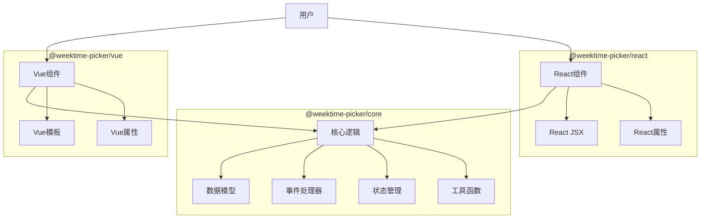
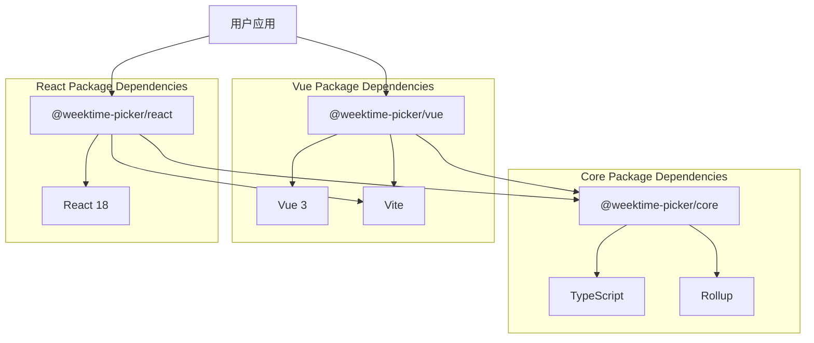
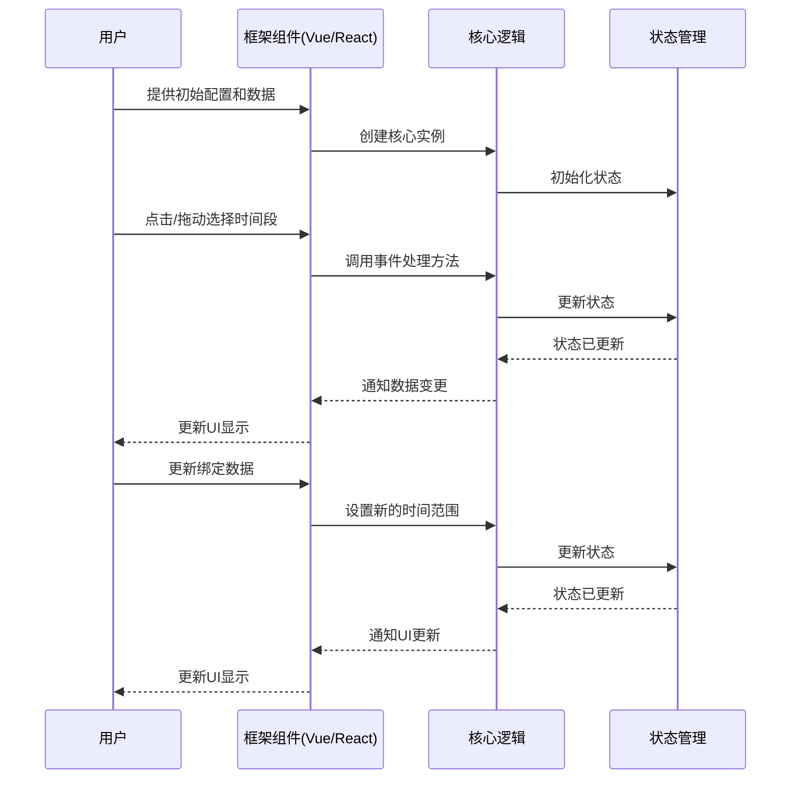

# 周时间选择器组件设计文档

## 整体架构图



## 分层设计和核心组件

### 1. 核心层 (@weektime-picker/core)

核心层负责实现与框架无关的逻辑，包括：

#### 1.1 数据模型

```typescript
// 时间范围接口
interface TimeRange {
  dayOfWeek: number; // 0-6，表示周一到周日
  startTime: string; // 格式如 "HH:MM"，表示开始时间
  endTime: string;   // 格式如 "HH:MM"，表示结束时间
}

// 配置选项接口
interface WeekTimeGridOptions {
  dayLabels?: string[];        // 星期标签，默认为周一到周日
  startHour?: number;          // 开始小时，默认为0
  endHour?: number;            // 结束小时，默认为23
  timeInterval?: number;       // 时间间隔（分钟），默认为60（1小时）
}

// 单元格状态接口
interface CellState {
  dayOfWeek: number;           // 星期（0-6）
  hour: number;                // 小时
  minute: number;              // 分钟
  selected: boolean;           // 是否选中
}
```

#### 1.2 状态管理

```typescript
class WeekTimeGridState {
  // 网格状态（二维数组）
  private gridState: CellState[][];
  
  // 当前选中的时间范围
  private selectedRanges: TimeRange[];
  
  // 配置选项
  private options: WeekTimeGridOptions;
  
  // 构造函数
  constructor(options: WeekTimeGridOptions);
  
  // 初始化网格状态
  public initializeGrid(): void;
  
  // 更新单元格状态
  public updateCell(dayOfWeek: number, hour: number, minute: number, selected: boolean): void;
  
  // 获取网格状态
  public getGridState(): CellState[][];
  
  // 获取选中的时间范围
  public getSelectedRanges(): TimeRange[];
  
  // 设置选中的时间范围
  public setSelectedRanges(ranges: TimeRange[]): void;
  
  // 清除所有选中
  public clearSelection(): void;
}
```

#### 1.3 事件处理器

```typescript
class WeekTimeGridEventHandler {
  // 状态管理器
  private state: WeekTimeGridState;
  
  // 是否正在拖动
  private isDragging: boolean;
  
  // 拖动起始单元格
  private dragStartCell: { dayOfWeek: number, hour: number, minute: number } | null;
  
  // 拖动当前单元格
  private dragCurrentCell: { dayOfWeek: number, hour: number, minute: number } | null;
  
  // 拖动模式（选中或取消选中）
  private dragMode: 'select' | 'deselect';
  
  // 构造函数
  constructor(state: WeekTimeGridState);
  
  // 处理单元格点击
  public handleCellClick(dayOfWeek: number, hour: number, minute: number): void;
  
  // 处理拖动开始
  public handleDragStart(dayOfWeek: number, hour: number, minute: number): void;
  
  // 处理拖动移动
  public handleDragMove(dayOfWeek: number, hour: number, minute: number): void;
  
  // 处理拖动结束
  public handleDragEnd(): void;
  
  // 更新选中状态
  private updateSelection(startCell: { dayOfWeek: number, hour: number, minute: number }, endCell: { dayOfWeek: number, hour: number, minute: number }, mode: 'select' | 'deselect'): void;
}
```

#### 1.4 工具函数

```typescript
// 将网格状态转换为时间范围数组
function gridStateToTimeRanges(gridState: CellState[][], timeInterval: number): TimeRange[];

// 将时间范围数组转换为网格状态
function timeRangesToGridState(timeRanges: TimeRange[], options: WeekTimeGridOptions): CellState[][];

// 格式化时间（小时:分钟）
function formatTime(hour: number, minute: number): string;

// 解析时间字符串
function parseTime(timeString: string): { hour: number, minute: number };
```

#### 1.5 核心类

```typescript
class WeekTimeGridCore {
  // 状态管理器
  private state: WeekTimeGridState;
  
  // 事件处理器
  private eventHandler: WeekTimeGridEventHandler;
  
  // 配置选项
  private options: WeekTimeGridOptions;
  
  // 回调函数
  private onChange: (ranges: TimeRange[]) => void;
  
  // 构造函数
  constructor(options: WeekTimeGridOptions, initialRanges: TimeRange[], onChange: (ranges: TimeRange[]) => void);
  
  // 获取网格配置
  public getGridConfig(): { rows: number, cols: number, dayLabels: string[], hourLabels: string[] };
  
  // 获取单元格状态
  public getCellState(dayOfWeek: number, hour: number, minute: number): boolean;
  
  // 处理单元格点击
  public handleCellClick(dayOfWeek: number, hour: number, minute: number): void;
  
  // 处理拖动开始
  public handleDragStart(dayOfWeek: number, hour: number, minute: number): void;
  
  // 处理拖动移动
  public handleDragMove(dayOfWeek: number, hour: number, minute: number): void;
  
  // 处理拖动结束
  public handleDragEnd(): void;
  
  // 设置选中的时间范围
  public setSelectedRanges(ranges: TimeRange[]): void;
  
  // 获取选中的时间范围
  public getSelectedRanges(): TimeRange[];
}
```

### 2. Vue 组件层 (@weektime-picker/vue)

```vue
<template>
  <!-- 网格容器 -->
  <div class="week-time-grid">
    <!-- 表头（小时标签） -->
    <div class="week-time-grid__header">
      <div class="week-time-grid__header-cell week-time-grid__header-cell--empty"></div>
      <div 
        v-for="hourLabel in hourLabels" 
        :key="hourLabel" 
        class="week-time-grid__header-cell"
      >
        {{ hourLabel }}
      </div>
    </div>
    
    <!-- 网格主体 -->
    <div class="week-time-grid__body">
      <!-- 每一行（星期） -->
      <div 
        v-for="(dayLabel, dayIndex) in dayLabels" 
        :key="dayIndex" 
        class="week-time-grid__row"
      >
        <!-- 行标签（星期） -->
        <div class="week-time-grid__row-label">{{ dayLabel }}</div>
        
        <!-- 单元格 -->
        <div 
          v-for="(cell, cellIndex) in getCellsForDay(dayIndex)" 
          :key="cellIndex" 
          class="week-time-grid__cell" 
          :class="{ 'week-time-grid__cell--selected': cell.selected }" 
          @mousedown="handleMouseDown(dayIndex, cell.hour, cell.minute)" 
          @mousemove="handleMouseMove(dayIndex, cell.hour, cell.minute)" 
          @mouseup="handleMouseUp()" 
        ></div>
      </div>
    </div>
  </div>
</template>

<script lang="ts">
import { defineComponent, computed, ref, watch, onMounted, onUnmounted } from 'vue';
import { WeekTimeGridCore, TimeRange, WeekTimeGridOptions } from '@weektime-picker/core';

export default defineComponent({
  name: 'WeekTimeGrid',
  
  props: {
    modelValue: {
      type: Array as () => TimeRange[],
      default: () => []
    },
    dayLabels: {
      type: Array as () => string[],
      default: () => ['周一', '周二', '周三', '周四', '周五', '周六', '周日']
    },
    startHour: {
      type: Number,
      default: 0
    },
    endHour: {
      type: Number,
      default: 23
    },
    timeInterval: {
      type: Number,
      default: 60 // 默认1小时（60分钟）
    }
  },
  
  emits: ['update:modelValue'],
  
  setup(props, { emit }) {
    // 创建核心实例
    const core = ref<WeekTimeGridCore | null>(null);
    
    // 是否正在拖动
    const isDragging = ref(false);
    
    // 计算小时标签
    const hourLabels = computed(() => {
      const labels = [];
      for (let hour = props.startHour; hour <= props.endHour; hour++) {
        labels.push(`${hour}:00`);
      }
      return labels;
    });
    
    // 初始化核心实例
    onMounted(() => {
      const options: WeekTimeGridOptions = {
        dayLabels: props.dayLabels,
        startHour: props.startHour,
        endHour: props.endHour,
        timeInterval: props.timeInterval
      };
      
      core.value = new WeekTimeGridCore(
        options,
        props.modelValue,
        (ranges: TimeRange[]) => emit('update:modelValue', ranges)
      );
    });
    
    // 监听属性变化
    watch(() => props.modelValue, (newValue) => {
      if (core.value) {
        core.value.setSelectedRanges(newValue);
      }
    }, { deep: true });
    
    // 获取某一天的所有单元格
    const getCellsForDay = (dayIndex: number) => {
      if (!core.value) return [];
      
      const cells = [];
      const intervalsPerHour = 60 / props.timeInterval;
      
      for (let hour = props.startHour; hour <= props.endHour; hour++) {
        for (let i = 0; i < intervalsPerHour; i++) {
          const minute = i * props.timeInterval;
          cells.push({
            hour,
            minute,
            selected: core.value.getCellState(dayIndex, hour, minute)
          });
        }
      }
      
      return cells;
    };
    
    // 处理鼠标按下事件
    const handleMouseDown = (dayIndex: number, hour: number, minute: number) => {
      if (!core.value) return;
      
      isDragging.value = true;
      core.value.handleDragStart(dayIndex, hour, minute);
      
      // 添加全局鼠标事件监听
      window.addEventListener('mouseup', handleMouseUp);
    };
    
    // 处理鼠标移动事件
    const handleMouseMove = (dayIndex: number, hour: number, minute: number) => {
      if (!isDragging.value || !core.value) return;
      
      core.value.handleDragMove(dayIndex, hour, minute);
    };
    
    // 处理鼠标松开事件
    const handleMouseUp = () => {
      if (!isDragging.value || !core.value) return;
      
      isDragging.value = false;
      core.value.handleDragEnd();
      
      // 移除全局鼠标事件监听
      window.removeEventListener('mouseup', handleMouseUp);
    };
    
    // 清理事件监听
    onUnmounted(() => {
      window.removeEventListener('mouseup', handleMouseUp);
    });
    
    return {
      hourLabels,
      getCellsForDay,
      handleMouseDown,
      handleMouseMove,
      handleMouseUp
    };
  }
});
</script>

<style scoped>
.week-time-grid {
  display: flex;
  flex-direction: column;
  border: 1px solid #e0e0e0;
  user-select: none;
}

.week-time-grid__header {
  display: flex;
  border-bottom: 1px solid #e0e0e0;
}

.week-time-grid__header-cell {
  flex: 1;
  padding: 8px;
  text-align: center;
  font-weight: bold;
  background-color: #f5f5f5;
}

.week-time-grid__header-cell--empty {
  width: 80px;
  flex: none;
}

.week-time-grid__body {
  display: flex;
  flex-direction: column;
}

.week-time-grid__row {
  display: flex;
  border-bottom: 1px solid #e0e0e0;
}

.week-time-grid__row:last-child {
  border-bottom: none;
}

.week-time-grid__row-label {
  width: 80px;
  padding: 8px;
  display: flex;
  align-items: center;
  justify-content: center;
  background-color: #f5f5f5;
  border-right: 1px solid #e0e0e0;
}

.week-time-grid__cell {
  flex: 1;
  height: 30px;
  border-right: 1px solid #e0e0e0;
  cursor: pointer;
}

.week-time-grid__cell:last-child {
  border-right: none;
}

.week-time-grid__cell--selected {
  background-color: #2196f3;
}
</style>
```

### 3. React 组件层 (@weektime-picker/react)

```tsx
import React, { useEffect, useState, useRef, useMemo } from 'react';
import { WeekTimeGridCore, TimeRange, WeekTimeGridOptions } from '@weektime-picker/core';

interface WeekTimeGridProps {
  value: TimeRange[];
  onChange: (ranges: TimeRange[]) => void;
  dayLabels?: string[];
  startHour?: number;
  endHour?: number;
  timeInterval?: number;
}

const WeekTimeGrid: React.FC<WeekTimeGridProps> = ({
  value = [],
  onChange,
  dayLabels = ['周一', '周二', '周三', '周四', '周五', '周六', '周日'],
  startHour = 0,
  endHour = 23,
  timeInterval = 60 // 默认1小时（60分钟）
}) => {
  // 核心实例
  const coreRef = useRef<WeekTimeGridCore | null>(null);
  
  // 是否正在拖动
  const [isDragging, setIsDragging] = useState(false);
  
  // 计算小时标签
  const hourLabels = useMemo(() => {
    const labels = [];
    for (let hour = startHour; hour <= endHour; hour++) {
      labels.push(`${hour}:00`);
    }
    return labels;
  }, [startHour, endHour]);
  
  // 初始化核心实例
  useEffect(() => {
    const options: WeekTimeGridOptions = {
      dayLabels,
      startHour,
      endHour,
      timeInterval
    };
    
    coreRef.current = new WeekTimeGridCore(
      options,
      value,
      onChange
    );
    
    // 清理函数
    return () => {
      window.removeEventListener('mouseup', handleMouseUp);
    };
  }, []);
  
  // 监听属性变化
  useEffect(() => {
    if (coreRef.current) {
      coreRef.current.setSelectedRanges(value);
    }
  }, [value]);
  
  // 获取某一天的所有单元格
  const getCellsForDay = (dayIndex: number) => {
    if (!coreRef.current) return [];
    
    const cells = [];
    const intervalsPerHour = 60 / timeInterval;
    
    for (let hour = startHour; hour <= endHour; hour++) {
      for (let i = 0; i < intervalsPerHour; i++) {
        const minute = i * timeInterval;
        cells.push({
          hour,
          minute,
          selected: coreRef.current.getCellState(dayIndex, hour, minute)
        });
      }
    }
    
    return cells;
  };
  
  // 处理鼠标按下事件
  const handleMouseDown = (dayIndex: number, hour: number, minute: number) => {
    if (!coreRef.current) return;
    
    setIsDragging(true);
    coreRef.current.handleDragStart(dayIndex, hour, minute);
    
    // 添加全局鼠标事件监听
    window.addEventListener('mouseup', handleMouseUp);
  };
  
  // 处理鼠标移动事件
  const handleMouseMove = (dayIndex: number, hour: number, minute: number) => {
    if (!isDragging || !coreRef.current) return;
    
    coreRef.current.handleDragMove(dayIndex, hour, minute);
  };
  
  // 处理鼠标松开事件
  const handleMouseUp = () => {
    if (!isDragging || !coreRef.current) return;
    
    setIsDragging(false);
    coreRef.current.handleDragEnd();
    
    // 移除全局鼠标事件监听
    window.removeEventListener('mouseup', handleMouseUp);
  };
  
  return (
    <div className="week-time-grid">
      {/* 表头（小时标签） */}
      <div className="week-time-grid__header">
        <div className="week-time-grid__header-cell week-time-grid__header-cell--empty"></div>
        {hourLabels.map((hourLabel, index) => (
          <div key={index} className="week-time-grid__header-cell">
            {hourLabel}
          </div>
        ))}
      </div>
      
      {/* 网格主体 */}
      <div className="week-time-grid__body">
        {dayLabels.map((dayLabel, dayIndex) => (
          <div key={dayIndex} className="week-time-grid__row">
            {/* 行标签（星期） */}
            <div className="week-time-grid__row-label">{dayLabel}</div>
            
            {/* 单元格 */}
            {getCellsForDay(dayIndex).map((cell, cellIndex) => (
              <div
                key={cellIndex}
                className={`week-time-grid__cell ${cell.selected ? 'week-time-grid__cell--selected' : ''}`}
                onMouseDown={() => handleMouseDown(dayIndex, cell.hour, cell.minute)}
                onMouseMove={() => handleMouseMove(dayIndex, cell.hour, cell.minute)}
              ></div>
            ))}
          </div>
        ))}
      </div>
    </div>
  );
};

export default WeekTimeGrid;
```

## 模块依赖关系图



## 接口契约定义

### 1. 核心包接口

```typescript
// 时间范围接口
export interface TimeRange {
  dayOfWeek: number; // 0-6，表示周一到周日
  startTime: string; // 格式如 "HH:MM"，表示开始时间
  endTime: string;   // 格式如 "HH:MM"，表示结束时间
}

// 配置选项接口
export interface WeekTimeGridOptions {
  dayLabels?: string[];        // 星期标签，默认为周一到周日
  startHour?: number;          // 开始小时，默认为0
  endHour?: number;            // 结束小时，默认为23
  timeInterval?: number;       // 时间间隔（分钟），默认为60（1小时）
}

// 核心类接口
export interface IWeekTimeGridCore {
  // 获取网格配置
  getGridConfig(): { rows: number, cols: number, dayLabels: string[], hourLabels: string[] };
  
  // 获取单元格状态
  getCellState(dayOfWeek: number, hour: number, minute: number): boolean;
  
  // 处理单元格点击
  handleCellClick(dayOfWeek: number, hour: number, minute: number): void;
  
  // 处理拖动开始
  handleDragStart(dayOfWeek: number, hour: number, minute: number): void;
  
  // 处理拖动移动
  handleDragMove(dayOfWeek: number, hour: number, minute: number): void;
  
  // 处理拖动结束
  handleDragEnd(): void;
  
  // 设置选中的时间范围
  setSelectedRanges(ranges: TimeRange[]): void;
  
  // 获取选中的时间范围
  getSelectedRanges(): TimeRange[];
}
```

### 2. Vue 组件接口

```typescript
// Props 接口
export interface WeekTimeGridProps {
  modelValue: TimeRange[];      // v-model 绑定值
  dayLabels?: string[];         // 星期标签
  startHour?: number;           // 开始小时
  endHour?: number;             // 结束小时
  timeInterval?: number;        // 时间间隔（分钟）
}

// 事件接口
export interface WeekTimeGridEvents {
  'update:modelValue': (ranges: TimeRange[]) => void; // v-model 更新事件
}
```

### 3. React 组件接口

```typescript
// Props 接口
export interface WeekTimeGridProps {
  value: TimeRange[];           // 绑定值
  onChange: (ranges: TimeRange[]) => void; // 变更回调
  dayLabels?: string[];         // 星期标签
  startHour?: number;           // 开始小时
  endHour?: number;             // 结束小时
  timeInterval?: number;        // 时间间隔（分钟）
}
```

## 数据流向图



## 异常处理策略

### 1. 输入验证

- **配置选项验证**：验证所有配置选项的有效性，包括时间范围、时间间隔等
- **数据格式验证**：验证输入的时间范围数组格式是否正确

### 2. 边界情况处理

- **空数据处理**：当没有选中任何时间段时，返回空数组
- **无效时间处理**：忽略超出配置范围的时间段
- **重叠时间处理**：合并重叠的时间段

### 3. 交互异常处理

- **拖动边界处理**：限制拖动选择在网格范围内
- **事件冲突处理**：确保事件处理的一致性，避免状态不同步

### 4. 错误恢复

- **状态恢复**：在操作失败时恢复到上一个有效状态
- **错误日志**：记录错误信息，便于调试

### 5. 性能优化

- **防抖处理**：对频繁触发的事件（如拖动）进行防抖处理
- **批量更新**：批量处理状态更新，减少重渲染次数