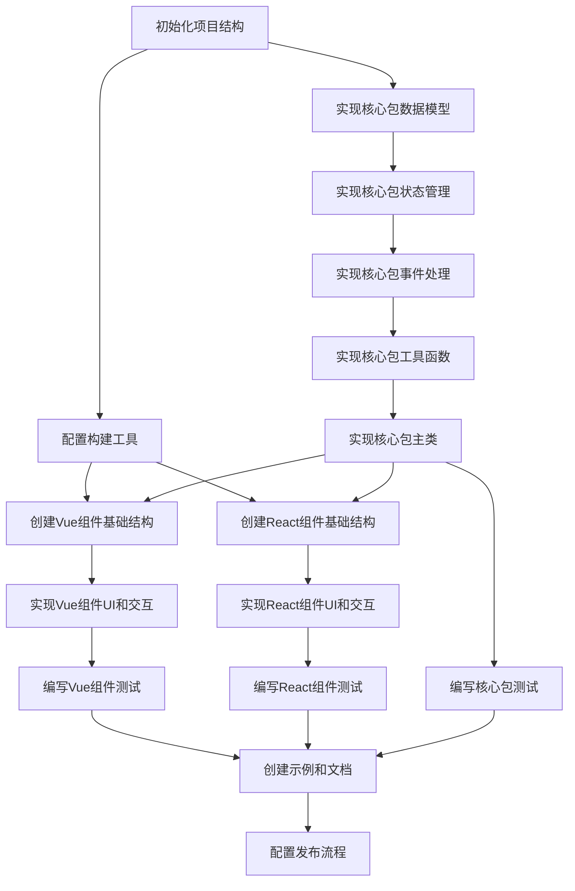

# 周时间选择器组件任务拆分

## 任务依赖图

## 原子任务列表

### 任务1：初始化项目结构

**输入契约**：
- 需求文档和设计文档
- 开发环境（Node.js, pnpm）

**输出契约**：
- 创建 monorepo 项目结构
- 配置 pnpm workspace
- 初始化各包的基本文件结构

**实现约束**：
- 使用 pnpm workspace 管理包
- 创建三个子包：core、vue、react
- 配置基本的 package.json 和 tsconfig.json

**依赖关系**：
- 无前置依赖
- 后置任务：任务2、任务3

### 任务2：配置构建工具

**输入契约**：
- 初始化的项目结构

**输出契约**：
- 配置 Rollup 用于打包核心包
- 配置 Vite 用于开发和构建 Vue/React 组件
- 配置 TypeScript
- 配置测试工具

**实现约束**：
- 使用 Rollup 打包核心包，输出 ESM 和 CommonJS 格式
- 使用 Vite 开发和构建框架组件
- 配置适当的 TypeScript 设置

**依赖关系**：
- 前置依赖：任务1
- 后置任务：任务8、任务9

### 任务3：实现核心包数据模型

**输入契约**：
- 初始化的项目结构
- 设计文档中的数据模型定义

**输出契约**：
- 实现 TimeRange 接口
- 实现 WeekTimeGridOptions 接口
- 实现 CellState 接口

**实现约束**：
- 使用 TypeScript 接口定义
- 确保类型定义完整
- 添加必要的注释

**依赖关系**：
- 前置依赖：任务1
- 后置任务：任务4

### 任务4：实现核心包状态管理

**输入契约**：
- 核心包数据模型
- 设计文档中的状态管理定义

**输出契约**：
- 实现 WeekTimeGridState 类
- 实现网格状态初始化和更新方法
- 实现时间范围转换方法

**实现约束**：
- 使用 TypeScript 类实现
- 确保状态管理的一致性
- 实现必要的数据转换方法

**依赖关系**：
- 前置依赖：任务3
- 后置任务：任务5

### 任务5：实现核心包事件处理

**输入契约**：
- 核心包状态管理
- 设计文档中的事件处理定义

**输出契约**：
- 实现 WeekTimeGridEventHandler 类
- 实现点击和拖动事件处理方法
- 实现选中状态更新方法

**实现约束**：
- 使用 TypeScript 类实现
- 确保事件处理的一致性
- 实现必要的状态更新方法

**依赖关系**：
- 前置依赖：任务4
- 后置任务：任务6

### 任务6：实现核心包工具函数

**输入契约**：
- 核心包数据模型
- 设计文档中的工具函数定义

**输出契约**：
- 实现 gridStateToTimeRanges 函数
- 实现 timeRangesToGridState 函数
- 实现 formatTime 和 parseTime 函数

**实现约束**：
- 使用纯函数实现
- 确保函数的可测试性
- 添加必要的注释

**依赖关系**：
- 前置依赖：任务5
- 后置任务：任务7

### 任务7：实现核心包主类

**输入契约**：
- 核心包数据模型
- 核心包状态管理
- 核心包事件处理
- 核心包工具函数

**输出契约**：
- 实现 WeekTimeGridCore 类
- 实现公共 API 方法
- 导出必要的接口和类

**实现约束**：
- 使用 TypeScript 类实现
- 确保 API 的一致性和可用性
- 实现必要的状态和事件处理集成

**依赖关系**：
- 前置依赖：任务6
- 后置任务：任务8、任务9、任务13

### 任务8：创建Vue组件基础结构

**输入契约**：
- 配置好的构建工具
- 核心包主类

**输出契约**：
- 创建 Vue 组件基础结构
- 定义组件 props 和事件
- 集成核心包

**实现约束**：
- 使用 Vue 3 组合式 API
- 确保与核心包的正确集成
- 定义必要的类型

**依赖关系**：
- 前置依赖：任务2、任务7
- 后置任务：任务10

### 任务9：创建React组件基础结构

**输入契约**：
- 配置好的构建工具
- 核心包主类

**输出契约**：
- 创建 React 组件基础结构
- 定义组件 props
- 集成核心包

**实现约束**：
- 使用 React 函数组件和 Hooks
- 确保与核心包的正确集成
- 定义必要的类型

**依赖关系**：
- 前置依赖：任务2、任务7
- 后置任务：任务11

### 任务10：实现Vue组件UI和交互

**输入契约**：
- Vue组件基础结构

**输出契约**：
- 实现组件模板
- 实现样式
- 实现交互逻辑

**实现约束**：
- 使用 Vue 3 模板语法
- 使用 CSS 实现样式
- 确保交互的流畅性和一致性

**依赖关系**：
- 前置依赖：任务8
- 后置任务：任务12

### 任务11：实现React组件UI和交互

**输入契约**：
- React组件基础结构

**输出契约**：
- 实现组件 JSX
- 实现样式
- 实现交互逻辑

**实现约束**：
- 使用 React JSX 语法
- 使用 CSS 实现样式
- 确保交互的流畅性和一致性

**依赖关系**：
- 前置依赖：任务9
- 后置任务：任务13

### 任务12：编写Vue组件测试

**输入契约**：
- 实现完成的 Vue 组件

**输出契约**：
- 编写组件单元测试
- 测试组件渲染
- 测试组件交互
- 测试组件 props 和事件

**实现约束**：
- 使用 Vitest 和 @vue/test-utils
- 确保测试覆盖主要功能
- 确保测试的可维护性

**依赖关系**：
- 前置依赖：任务10
- 后置任务：任务14

### 任务13：编写React组件测试

**输入契约**：
- 实现完成的 React 组件

**输出契约**：
- 编写组件单元测试
- 测试组件渲染
- 测试组件交互
- 测试组件 props 和回调

**实现约束**：
- 使用 Vitest 和 @testing-library/react
- 确保测试覆盖主要功能
- 确保测试的可维护性

**依赖关系**：
- 前置依赖：任务11
- 后置任务：任务14

### 任务14：编写核心包测试

**输入契约**：
- 实现完成的核心包

**输出契约**：
- 编写数据模型测试
- 编写状态管理测试
- 编写事件处理测试
- 编写工具函数测试
- 编写主类测试

**实现约束**：
- 使用 Jest 或 Vitest
- 确保测试覆盖主要功能
- 确保测试的可维护性

**依赖关系**：
- 前置依赖：任务7
- 后置任务：任务15

### 任务15：创建示例和文档

**输入契约**：
- 实现完成的 Vue 组件
- 实现完成的 React 组件
- 测试通过的核心包

**输出契约**：
- 创建 Vue 示例
- 创建 React 示例
- 编写使用文档
- 编写 API 文档

**实现约束**：
- 创建简单明了的示例
- 编写清晰的文档
- 包含所有公共 API 的说明

**依赖关系**：
- 前置依赖：任务12、任务13、任务14
- 后置任务：任务16

### 任务16：配置发布流程

**输入契约**：
- 完成的组件和文档

**输出契约**：
- 配置 npm 发布脚本
- 设置版本管理
- 准备发布说明

**实现约束**：
- 使用 lerna 或 pnpm 管理发布
- 确保包的正确依赖关系
- 设置适当的访问权限

**依赖关系**：
- 前置依赖：任务15
- 无后置依赖